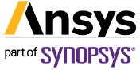
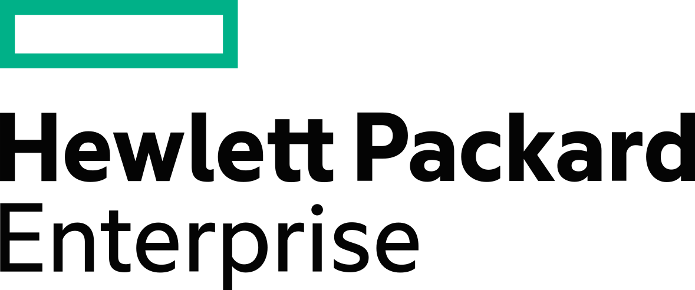
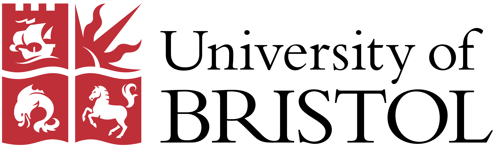

{:height="auto" width="100%"} 
<!-- {:height="auto" width="100%"} -->

<h1>Welcome to EuroMPI/USA'25</h1> 
  
October 1 - October 3 2025, Charlotte, NC, USA

  

  

  In 2025, EuroMPI Conference will take place in Charlotte, NC in the week of October 1 - October 3, 2025. The conference will be co-located with the <a href="https://www.iwomp.org">21th International Workshop on OpenMP (IWOMP 2025)</a> that will be held the same week. The MPI Forum will also meet following the EuroMPI Conference. The dates will be updated once we get closer to the event.
  

  

  The EuroMPI conference is the preeminent meeting for users, developers and researchers to interact and discuss new developments and applications of the Message Passing Interface (MPI). This includes new proposed concepts and extensions to the MPI standard, libraries and languages built on top of MPI, interfaces to other standards in parallel programming, applications and optimizations to new architectures and networks, novel algorithms, and tools, with particular focus on quality, portability, performance, and scalability. The annual meeting has a long, rich tradition, and has been held since 1994.
  

  

  Through the presentation of contributed papers, posters and invited talks, the conference presents a complete overview of MPI, its current usage in the parallel programming landscape, and its future directions. The EuroMPI conference provides ample opportunities for attendees to interact and share ideas and experiences to contribute to the improvement and furthering of message-passing and related parallel programming paradigms.
  

EuroMPI/USA is made possible through the generous support of the following organisations and sponsors.
<table border="0">
  <tr>
    <td></td>
    <td></td>
    <td></td>
  </tr>
</table>

  
 
  

  

  <h2>Register</h2>
  <a href="https://eurompi.org/register">Registration></a> is open. Early bird rates end <b>August 31, 2025</b>!
  

  

<h2>Contact</h2>

For queries relating to the conference or research papers (submission, deadlines, publishing, etc.) please contact <a href="eurompiconference@gmail.com">eurompiconference@gmail.com</a>

<!---

<h2>Sponsors</h2>
Thanks to our sponsors for their contribution to the success of the event.

 

    

    

    

--->
